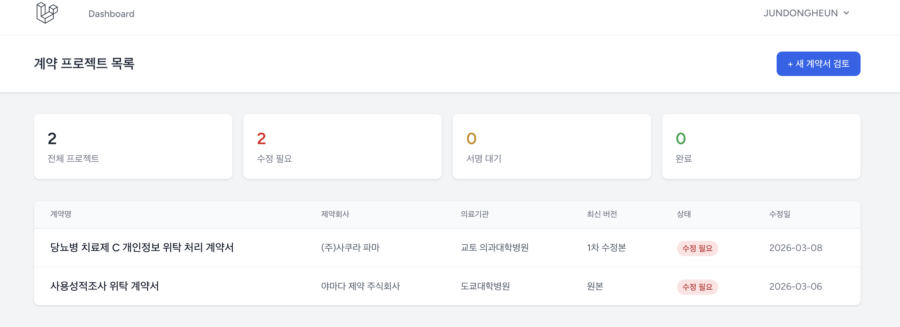
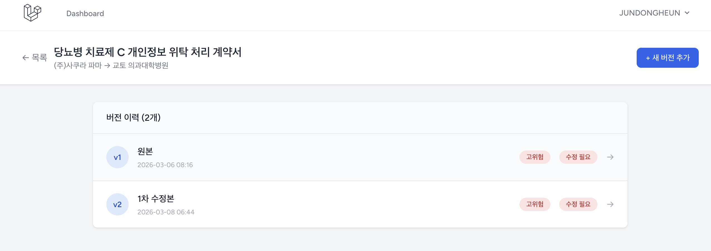
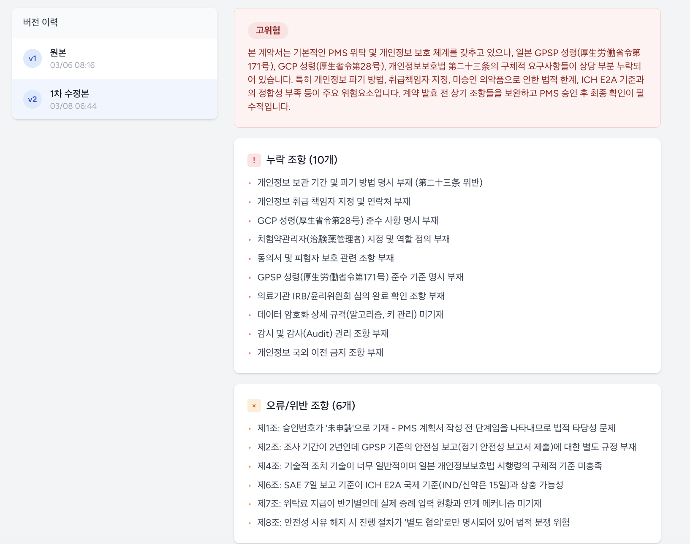
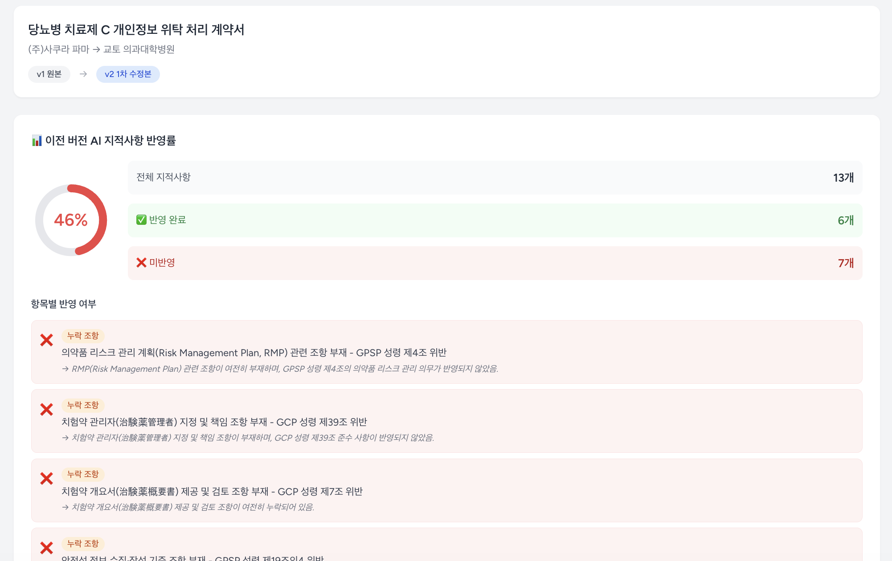
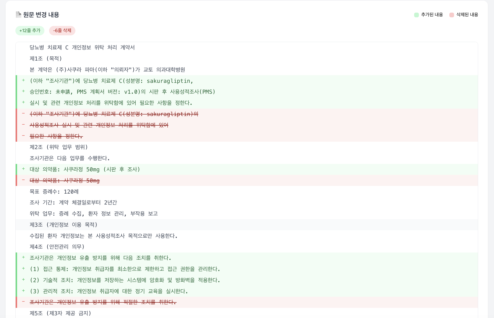

# AI-PMS
**AI 기반 일본 PMS 계약서 자동 검토 시스템**

일본 제약 시판후조사(PMS) 계약서를 Claude AI와 RAG(검색 증강 생성)로 자동 분석해 법령 위반 조항, 누락 조항, 개선 제안을 제공하는 웹 애플리케이션입니다.

---

## 스크린샷

**계약 프로젝트 대시보드**


**버전 이력 관리**


**AI 검토 결과 (누락 조항 / 오류 조항 / 개선 제안)**


**AI 지적사항 반영률 분석**


**버전 간 Diff 비교 (LCS 알고리즘)**


---

## 주요 기능

- **계약서 AI 검토** — GPSP 성령, GCP 성령, ICH E2A, 개인정보보호법 기준으로 자동 분석
- **리스크 등급 판정** — HIGH / MEDIUM / LOW 3단계
- **버전 관리** — 계약서 수정 이력 추적 (원본 → 1차 수정본 → 2차 수정본)
- **버전 Diff 비교** — LCS 알고리즘으로 이전 버전과의 변경 내용 줄 단위 시각화
- **AI 지적사항 반영률** — 이전 버전 지적사항이 새 버전에 얼마나 반영됐는지 % 표시
- **계약서 암호화** — AES-256으로 원문 암호화 저장

---

## 기술 스택

| 구분 | 기술 |
|------|------|
| Backend | Laravel 12, PHP 8.5 |
| Frontend | Blade, Tailwind CSS, Vite |
| Database | MySQL 8 |
| AI | Claude API (claude-haiku) |
| Vector DB | Pinecone |
| Embedding | sentence-transformers (paraphrase-multilingual-mpnet-base-v2) |
| Reranking | CrossEncoder (ms-marco-MiniLM-L-6-v2) |
| RAG Server | FastAPI (Python 3.12) |
| 인증 | Laravel Breeze |

---

## 아키텍처

```
계약서 제출
  ↓
SHA-256 해시 → 캐시 확인 (API 비용 절감)
  ↓ 캐시 미스
FastAPI /search → Pinecone 벡터 검색 (Bi-Encoder top 20)
  ↓
CrossEncoder Reranking (top 5)
  ↓
Claude API 호출 (법령 컨텍스트 + 계약서 원문)
  ↓
JSON 파싱 → AES-256 암호화 → DB 저장
```

**RAG 법령 데이터 소스**
- 일본 GPSP 성령 (厚生労働省令第171号) — 42개 조항
- 일본 GCP 성령 (厚生省令第28号) — 197개 조항
- ICH E2A Clinical Safety Data Management Guideline — 11개 조항
- 일본 개인정보보호법 — 12개 조항

---

## 설치 및 실행

### 사전 요구사항
- PHP 8.5+, Composer
- Node.js 18+
- Python 3.12+
- MySQL 8
- Pinecone API Key
- Anthropic API Key

### 1. Laravel 설정

```bash
git clone https://github.com/jeondongheun/ai-pms.git
cd ai-pms

composer install
npm install

cp .env.example .env
php artisan key:generate
```

`.env` 설정:
```
DB_DATABASE=ai_pms
DB_USERNAME=root
DB_PASSWORD=your_password

ANTHROPIC_API_KEY=sk-ant-...
ANTHROPIC_MODEL=claude-haiku-4-5-20251001
ANTHROPIC_MAX_TOKENS=2000

PINECONE_API_KEY=your_pinecone_key
PINECONE_INDEX=ai-pms

RAG_SERVER_URL=http://localhost:8001
```

```bash
php artisan migrate
npm run build
```

### 2. Python RAG 서버 설정

```bash
python -m venv venv
source venv/bin/activate

pip install -r scripts/rag/requirements.txt

# 법령 데이터 Pinecone에 인덱싱 (최초 1회)
python scripts/rag/ingest.py
```

### 3. 서버 실행

```bash
# 터미널 1 - FastAPI RAG 서버
uvicorn scripts.rag.rag_server:app --host 0.0.0.0 --port 8001

# 터미널 2 - Laravel
php artisan serve

# 터미널 3 - Vite (개발 시)
npm run dev
```

`http://localhost:8000` 접속

---

## 주요 개선 사항

| 구분 | 문제 | 해결 | 효과 |
|------|------|------|------|
| 성능 | shell_exec로 Python 호출 시 매번 모델 로드 | FastAPI 상시 서버로 전환 | 30초 → 3초 |
| 보안 | 계약서 원문 평문 저장 | Laravel encrypted cast (AES-256) | 개인정보 보호 |
| 데이터 품질 | AI 실패 시 UNKNOWN 캐시 저장 | 유효성 검증 후 저장, 실패 시 삭제 | 캐시 오염 방지 |
| 안정성 | AI 실패 시 불완전 레코드 잔존 | DB::transaction 롤백 | 데이터 일관성 |
| 검색 품질 | 개인정보 쿼리 Rerank 점수 전부 음수 | 개인정보보호법 데이터 추가 | 검색 정확도 향상 |
